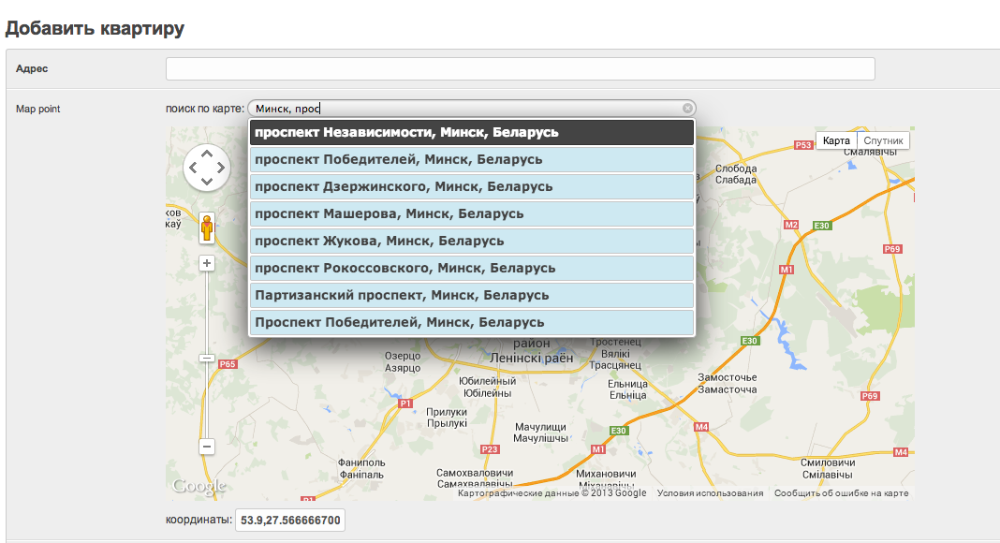

====================
Django-AddressPicker
====================

Simple Django app providing visual address picker widget using Google maps.

Original jQuery plugin: https://github.com/sgruhier/jquery-addresspicker

Installation
------------
1. Using pip:
::

    pip install -e git+git://github.com/Wildhind/django-addresspicker.git#egg=addresspicker

2. Add "addresspicker" to your INSTALLED_APPS setting like this::
::

    INSTALLED_APPS = (
          ...
          'addresspicker',
      )

Usage
-----
In your models.py:
::

    from addresspicker.fields import AddressPickerField

    map = AddressPickerField(_('place on map'), max_length=64)

